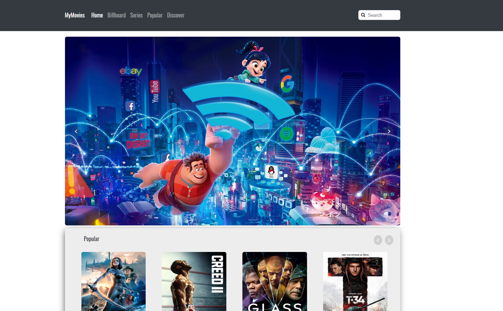

# MoviesApp

# Basic SPA website, Using Angular Html 5, Css, jquery.
Here home page, using just css, html, jquery. Using the [Movie DB](https://www.themoviedb.org/ "Movie db's Homepage") to query using JsonP callback, in rest query to get the data. 
Here some utilities made by me, check out my gitlab account. https://gitlab.com/geekMQ/utilities/blob/master/README.md
## Some updates soon.

##
##
##

# Cardview horizontal 

